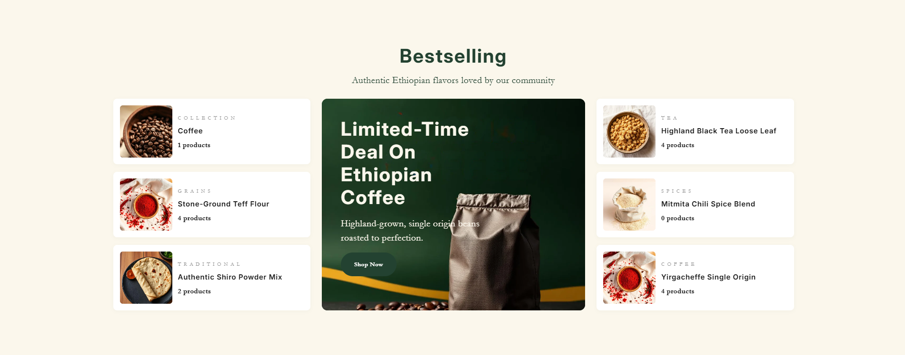
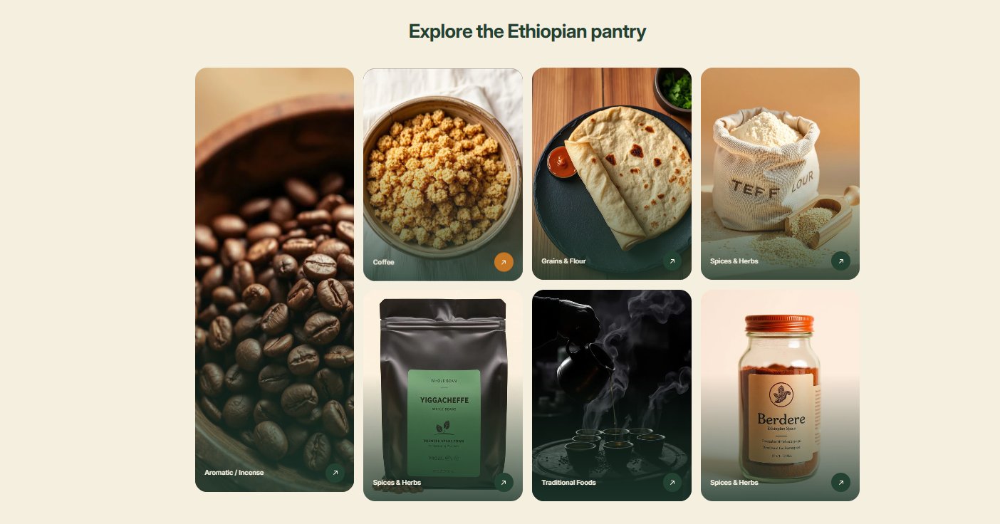
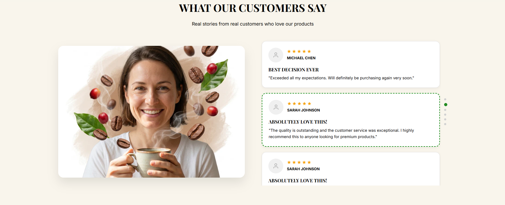
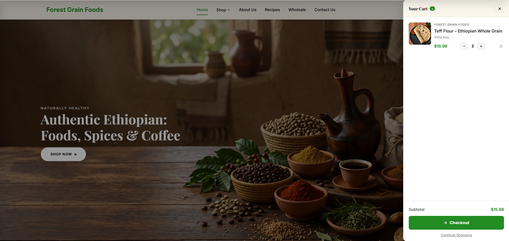
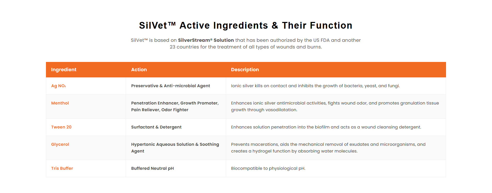

# 🛍️ Shopify Premium Standalone Custom Sections

Welcome to the ultimate repository of premium, high-converting, and fully standalone Shopify custom sections! Designed with visual excellence, state-of-the-art animations, and intuitive merchant controls.

---

## 🖼️ Visual Section Catalog

Below is a visual guide to the premium custom sections in this repository. Each section is showcased with its screenshot, key features, and a direct link to the source code.

---

### 1. Three Ecosystems (Fully Customizable)
*A high-impact landing page section for brand storytelling and navigation.*


👉 **Source Code:** [`three-ecosystems-fully-customizable.liquid`](./three-ecosystems-fully-customizable.liquid)

*   **Key Features**:
    *   **Centered Flexbox Layout**: Automatically centers cards even if the grid isn't full.
    *   **Dynamic Desktop Grid**: Supports up to 6 columns with customizable gaps.
    *   **Mobile Layout Options**: Choose between Stacked, Grid, or Horizontal Scroll.
    *   **Premium Animations**: Smooth hover lifts, image scaling, and scroll reveal effects.

---

### 2. Parallax Arched & Stacked Collage
*A visually stunning collage section with deep parallax effects and arched frames.*


👉 **Source Code:** [`parallax-image-stacked-arched-section.liquid`](./parallax-image-stacked-arched-section.liquid)

*   **Key Features**:
    *   **Arched Image Masks**: Unique modern aesthetic for hero sections.
    *   **Deep Parallax**: Layered movement for a premium feel.
    *   **Collage Mode**: Intelligent overlapping algorithm for pixel-perfect layouts.
    *   **Custom Typography**: Integrated support for premium font families.

---

### 3. Editorial Staggered Layout
*Perfect for lifestyle brands and editorial-style storytelling.*


👉 **Source Code:** [`text-with-2image.liquid`](./text-with-2image.liquid)

*   **Key Features**:
    *   **Asymmetric Design**: Dual offset images with floating text blocks.
    *   **Badge Support**: Add custom icon badges and labels to images.
    *   **Responsive Flow**: Automatically adjusts staggered layout for mobile clarity.

---

### 4. Bento Marketing Grid
*Modern, modular grid layout inspired by Bento design principles.*


👉 **Source Code:** [`bento-4-grid-section.liquid`](./bento-4-grid-section.liquid)

*   **Key Features**:
    *   **Multi-Purpose Blocks**: Mix images, text, and CTAs in a cohesive grid.
    *   **Hover Zoom Effects**: Interactive scaling for increased engagement.
    *   **Dynamic Sizing**: Cards automatically span different areas for visual interest.

---

### 5. Bento Masonry Gallery
*A clean, header-integrated masonry gallery for showcasing products or brand assets.*


👉 **Source Code:** [`bento-grid-masonary.liquid`](./bento-grid-masonary.liquid)

*   **Key Features**:
    *   **Integrated Header**: Seamless transition from title to gallery.
    *   **Masonry Flow**: Smart packing of images with various aspect ratios.
    *   **Lightweight**: Zero external dependencies, pure CSS masonry.

---

### 6. Premium Testimonials & Reviews
*Build trust with a highly customizable and interactive customer review section.*


👉 **Source Code:** [`customer-review.liquid`](./customer-review.liquid)

*   **Key Features**:
    *   **Star Ratings**: Integrated dynamic star rating system.
    *   **Profile Images**: Support for customer avatars and social handles.
    *   **Carousel Support**: Optional horizontal flow for multiple reviews.

---

### 7. Custom Shop By Category (Circle)
*Intuitive navigation section using modern circular image frames.*


👉 **Source Code:** [`custome-collection-circle.liquid`](./custome-collection-circle.liquid)

*   **Key Features**:
    *   **Circular Masks**: Elegant rounded aesthetic for category navigation.
    *   **Shop By Occasion**: Designed specifically for gifting or collection browsing.
    *   **Responsive Grid**: Scales from 2 to 8 items across different screen sizes.

---

### 8. Custom FAQ Accordion
*A clean, interactive FAQ section to answer customer queries and improve SEO.*


👉 **Source Code:** [`custom-faq.liquid`](./custom-faq.liquid)

*   **Key Features**:
    *   **Smooth Transitions**: High-performance CSS-based accordion animations.
    *   **SEO Optimized**: Structured for search engine visibility.
    *   **Fully Customizable**: Adjust icons, borders, and colors in the theme editor.

---

### 9. Premium Custom Features
*A feature-rich showcase section with floating testimonials and modern icons.*


👉 **Source Code:** [`custom-premium-features.liquid`](./custom-premium-features.liquid)

*   **Key Features**:
    *   **Floating Testimonial**: Interactive quote card that overlaps the main image.
    *   **Gradient Typography**: Beautifully styled gradient titles for high-end branding.
    *   **Feature Stack**: Clean list of benefits with customizable icons and backgrounds.
    *   **Modern Aesthetics**: Large border radii and soft shadows for a contemporary look.

---

### 10. Interactive Progress Pointer
*A scroll-animated process section to guide customers through your brand journey.*


👉 **Source Code:** [`progress-pointer-section.liquid`](./progress-pointer-section.liquid)

*   **Key Features**:
    *   **Scroll Animation**: Progress line that fills as the user scrolls through the section.
    *   **Numbered Milestones**: Circular step indicators with customizable styles.
    *   **Process Visualization**: Ideal for "How it Works" or "Our Story" narratives.
    *   **Responsive Flow**: Switches to a clean vertical stack on mobile devices.

---

### 11. Custom Premium Hero
*A versatile, high-impact hero section designed for maximum conversion.*


👉 **Source Code:** [`custom-hero.liquid`](./custom-hero.liquid)

*   **Key Features**:
    *   **Dynamic Overlays**: Control background opacity and text contrast easily.
    *   **Dual CTA Support**: Two primary call-to-action buttons with distinct styles.
    *   **Full-Height Option**: Toggle between viewport height or content-based height.
    *   **Parallax Background**: Optional smooth parallax effect for background images.

---

### 12. Comparison & Pricing Table
*A professional grid to showcase product differences or subscription plans.*


👉 **Source Code:** [`custom-comparison-section.liquid`](./custom-comparison-section.liquid)

*   **Key Features**:
    *   **Highlighted Column**: Feature a specific plan or product as "Recommended".
    *   **Status Icons**: Integrated checkmarks and crossmarks for feature lists.
    *   **Sticky Headers**: Keep plan names visible while scrolling (on supported devices).
    *   **Comparison Logic**: Clean, easy-to-read layout for decision-making.

---

### 13. Dynamic Brand Trustbar
*Build instant credibility with a scrolling bar of logos or trust badges.*


👉 **Source Code:** [`custom-trustbar.liquid`](./custom-trustbar.liquid)

*   **Key Features**:
    *   **Auto-Scroll Animation**: Seamless looping animation for brand logos.
    *   **SVG Integration**: Supports direct SVG code or image files for logos.
    *   **Flexible Layout**: Adjust logo size, spacing, and scrolling speed.
    *   **Merchant Controls**: Pause on hover and mobile-specific display options.

---

### 14. Animated Image Gallery
*A smooth, interactive slider gallery for showcasing products or brand imagery.*


👉 **Source Code:** [`animated-image-gallery.liquid`](./animated-image-gallery.liquid)

*   **Key Features**:
    *   **Interactive Slider**: Smooth navigation through images with arrow controls.
    *   **Customizable Layouts**: Support for both grid and slider modes.
    *   **Versatile Shapes**: Toggle between rectangular or circular card styles.
    *   **Responsive Design**: Automatically adjusts column counts for mobile, tablet, and desktop.

---

### 16. MossVida "How It Works"
*A numbered process grid designed for brand storytelling.*


👉 **Source Code:** [`how-it-works-section.liquid`](./how-it-works-section.liquid)

*   **Key Features**:
    *   **Overlay Numbering**: Large, semi-transparent background numbers for a modern editorial feel.
    *   **Staggered Card Design**: Beautifully balanced grid of process steps with subtle gradients.
    *   **Typography Focused**: Fine-tuned control over kicker, heading, and description styles.
    *   **Lightweight**: Zero dependencies, optimized for fast loading and mobile responsiveness.

---

### 17. Before/After Image with Text
*An interactive image comparison slider paired with compelling copy and feature cards for product transformations.*


👉 **Source Code:** [`before-after-image-with-text.liquid`](./before-after-image-with-text.liquid)

*   **Key Features**:
    *   **Interactive Comparison Slider**: Drag-to-compare before and after images with smooth mouse and touch support.
    *   **Scroll Reveal Animations**: Fade-in and slide-up effects for text elements as the section comes into view.
    *   **Left Content Block**: Customizable label, heading with optional italic accent, subheading, and divider.
    *   **Feature Cards**: Up to 3 numbered feature cards with titles and descriptions, automatic slide animation on scroll.
    *   **Dynamic Slider Handle**: Gold accent circle with SVG arrow icons for clear interaction cues.
    *   **Custom Typography Control**: Fine-tuned font sizes for headings, subheadings, and card text.
    *   **Responsive Design**: Stacks vertically on mobile with maintained aspect ratio for images.
    *   **Full Customization**: Control colors for background, text, accent, cards, and more via theme editor.

---

### 18. Cinematic Hero Banner
*A high-impact, full-screen hero section with parallax backgrounds and interactive stats.*


👉 **Source Code:** [`cenemetic-hero-banner.liquid`](./cenemetic-hero-banner.liquid)

*   **Key Features**:
    *   **Cinematic Parallax**: Smooth background zoom and parallax effects for a premium feel.
    *   **Dual CTA Support**: Primary action button and secondary video/ghost button.
    *   **Trust Widget**: Integrated reviewer avatars and star ratings for social proof.
    *   **Bento Stats Grid**: Modern modular stats grid that optimizes for mobile layouts.
    *   **Overlay Control**: Precise adjustment of color, opacity, and blur for background images.

---

### 19. Interactive Path Timeline
*A visually guided process timeline with dashed connectors and icon badges.*


👉 **Source Code:** [`path-timeline.liquid`](./path-timeline.liquid)

*   **Key Features**:
    *   **Animated Path**: Dashed connector line that guides the user's eye through steps.
    *   **Icon Badges**: Circular badges for each step with support for custom image icons.
    *   **Numbered Milestones**: Elegant gold-accented numbering for clear sequence.
    *   **Scroll-Triggered Reveals**: Smooth fade-up animations as the user scrolls through the process.

---

### 20. Product Pro Bundle Cards
*Modern pricing cards with a unique flex-row layout and ribbon overlays.*


👉 **Source Code:** [`prdocut-block-pro-bundle.liquid`](./prdocut-block-pro-bundle.liquid)

*   **Key Features**:
    *   **Asymmetric Design**: Unique flex-row layout with image on the left and content on the right.
    *   **Ribbon Overlays**: Customizable "Best Value" or "Popular" ribbons for specific cards.
    *   **Feature Checklists**: Integrated list system with custom checkmark icons and dividers.
    *   **Premium Themes**: Easily toggle between light and dark themes per card for visual hierarchy.

---

### 21. Premium CTA Section
*A high-conversion split-layout CTA with glowing buttons and magnetic hover effects.*


👉 **Source Code:** [`cta-premiun-section.liquid`](./cta-premiun-section.liquid)

*   **Key Features**:
    *   **Split Layout**: Compelling content on the left with a visually anchored button on the right.
    *   **Magnetic Buttons**: Modern interaction effects with pulsing glow animations.
    *   **Blur Reveal**: Sophisticated staggered blur and fade animations on load.
    *   **Section BG Control**: Full control over background image scale, overlay, and gradients.

---

### 22. Image with Trust Card & Text
*An editorial layout featuring a handwriting-style trust card and video-ready image blocks.*


👉 **Source Code:** [`image-text-trust-section.liquid`](./image-text-trust-section.liquid)

*   **Key Features**:
    *   **Trust Badge Overlay**: Floating handwriting-style card for personal brand trust.
    *   **Editorial Layout**: Sophisticated grid spacing with large typography and handwriting accents.
    *   **Video Integration**: Support for video background or image fallback in the main block.
    *   **Responsive Flow**: Automatically adjusts the grid and card overlap for mobile devices.

---

### 23. Two-Column Grid FAQ
*A space-efficient accordion section with background image support and auto-close logic.*


👉 **Source Code:** [`two-colum-grid-faq.liquid`](./two-colum-grid-faq.liquid)

*   **Key Features**:
    *   **Dual Columns**: Maximizes space by showing FAQs in two columns on desktop.
    *   **BG Image Overlays**: Beautiful full-section background images with customizable overlays.
    *   **Smart Accordion**: Auto-closing logic for siblings to keep the layout clean.
    *   **Merchant Customization**: Extensive controls for colors, sizes, and layout gaps.

---

### 24. Flat Grid Slider Reviews
*A minimalist review section with grid-to-slider transformation for mobile.*


👉 **Source Code:** [`custom-review-section-flat-3.liquid`](./custom-review-section-flat-3.liquid)

*   **Key Features**:
    *   **Grid Slider**: Displays as a clean grid on desktop and transforms into a draggable slider on mobile.
    *   **Minimalist Design**: Flat card aesthetic with subtle borders and star ratings.
    *   **Customizable Columns**: Choose between 2 or 3 columns for the review grid.
    *   **Smooth Navigation**: High-performance touch and mouse dragging for the slider mode.

---

### 25. Premium Sidebar Header & Cart
*A sophisticated navigation system with integrated sidebar cart and mobile-optimized drawer.*


👉 **Source Code:** [`full-custom-header-with-sidebar-cart.liquid`](./full-custom-header-with-sidebar-cart.liquid)

*   **Key Features**:
    *   **Sidebar Cart Drawer**: Seamless slide-out cart for a modern shopping experience.
    *   **Solid Navigation**: Clean, sticky header with logo centering and custom CTA buttons.
    *   **Mobile Drawer**: Fully responsive mobile menu with spring-based animations.
    *   **Visual Polish**: Integrated cart count badges, overlays, and refined typography controls.

---

### 26. FG Bestselling Grid
*A premium product showcase grid built for bestseller collections and high-impact merchandising.*



👉 **Source Code:** [`bestselling-custom-section.liquid`](./bestselling-custom-section.liquid)

*   **Key Features**:
    *   **Flexible Card Layout**: Auto-adjusts between single-column mobile and multi-column desktop grids.
    *   **Expandable Promo Banner**: Central promo card with overlay support, title, description, and CTA.
    *   **Hover Elevation**: Product card lift effect with dynamic shadow on hover.
    *   **Dual Image Support**: Primary and secondary product images with fade-on-hover transitions.
    *   **Customizable Typography**: Separate desktop and mobile sizing for headings, subheadings, and promo text.
    *   **Merchant Friendly Controls**: Background, spacing, card styling, and button colors are all editable in the theme editor.

---

### 27. Custom Pantry Grid
*A modern category/product grid section designed for lifestyle brands with bold navigation and content overlays.*



👉 **Source Code:** [`category-product-custom-section.liquid`](./category-product-custom-section.liquid)

*   **Key Features**:
    *   **Responsive Grid System**: Mobile and desktop column controls with adaptive gap spacing.
    *   **Custom Card Styling**: Rounded cards, border options, background overlays, and hover transform effects.
    *   **Tall Card Support**: Featured tall card spans multiple rows for elegant visual hierarchy.
    *   **Image Hover Zoom**: Smooth image scale effect on hover for immersive storytelling.
    *   **Overlay Gradient Control**: Fully editable overlay direction, colors, opacity, and stop positions.
    *   **Modern CTA Arrows**: Icon-based arrow buttons with hover-ready color transitions.

---

### 28. Vertical Testimonial
*A polished vertical testimonial section with a left feature image and scrollable review feed.*



👉 **Source Code:** [`premium-organic-testimonial.liquid`](./premium-organic-testimonial.liquid)

*   **Key Features**:
    *   **Vertical Review Carousel**: Smooth snap-scrolling testimonial cards with optional autoplay.
    *   **Responsive Two-Column Layout**: Left hero image and right-hand carousel on desktop.
    *   **Highlight Active Review**: Active card accent border and shadow for better focus.
    *   **Dot Navigation**: Clickable dot indicators with active state highlighting.
    *   **Full Theme Control**: Adjustable section spacing, colors, typography, and card styling.
    *   **Rich Content Support**: Avatar, star rating, title, review text, and customer name display.

---

### 29. Custom Navbar with Cart Drawer
*A complete, standalone navigation system with integrated slide-out cart drawer, predictive search modal, and responsive mobile menu — all in a single file.*



👉 **Source Code:** [`custom-navbar-with-drawer.liquid`](./custom-navbar-with-drawer.liquid)

*   **Key Features**:
    *   **Sticky / Fixed Navbar**: JS-powered scroll handler that keeps the navbar visible at all times, bypassing Shopify parent `overflow: hidden` issues.
    *   **Slide-Out Cart Drawer**: Full-viewport-height right-side drawer with real-time cart loading, quantity controls, item removal, and direct `/checkout` navigation.
    *   **Predictive Search Modal**: Top-sliding search panel using Shopify's `/search/suggest.json` API — shows products, collections, and articles in real time with keyboard support (Enter to navigate).
    *   **Responsive Mobile Menu**: Left-side slide-out drawer with accordion submenus, account link, and quick cart access.
    *   **Dropdown Menus**: Hover/click desktop dropdowns with `overflow: visible` chain and high z-index — never clipped by parent containers.
    *   **Cart Count Bubble**: Animated bump effect on add-to-cart, auto-updates via multiple Shopify event hooks.
    *   **150+ Theme Editor Controls**: Full color, typography, spacing, and layout customization for every component.
    *   **Zero Dependencies**: Pure vanilla JS + CSS, no libraries required.

---

### 30. Service Trust Section
*A flexible service/trust card grid for showcasing brand features or benefits with optional mobile carousel.*


👉 **Source Code:** [`custom-service-block.liquid`](./custom-service-block.liquid)

*   **Key Features**:
    *   **Up to 4 Service Cards**: Each with image, title, and description fields managed through the theme editor.
    *   **Responsive Grid**: Configurable column counts for desktop (1–6), tablet, and mobile breakpoints.
    *   **Mobile Carousel Mode**: Transforms the grid into a horizontal swipeable carousel with scroll-snap and drag support.
    *   **Hover Effects**: Configurable card lift and image scale on hover with custom shadows and transition speed.
    *   **Custom Web Component**: `<service-trust-carousel>` element handles drag-to-scroll on desktop and touch on mobile.
    *   **Full Theme Control**: Section background, card colors, borders, shadows, and image styling fully customizable.

---

### 32. SilVet Info Table
*A detailed ingredient information table that switches to card layout on mobile — ideal for product ingredient breakdowns or specification sheets.*



👉 **Source Code:** [`silvet-info-table.liquid`](./silvet-info-table.liquid)

*   **Key Features**:
    *   **Three-Column Table**: Clean desktop table layout with customizable column labels for ingredient, action, and description.
    *   **Mobile Card Layout**: Automatically converts to a vertically stacked card design on smaller screens for better readability.
    *   **Schema Block Rows**: Add unlimited ingredient rows via Shopify's block system with preset defaults.
    *   **Row Styling**: Even/odd row background colors and hover highlight for improved scanability.
    *   **Full Color Control**: Customize table header, border, row backgrounds, card colors, and text colors independently.
    *   **Table on Mobile Option**: Optionally force the table view on mobile with horizontal scrolling.

---

## 🛠️ Step-by-Step Installation Guide

Implementing any of these custom sections on your Shopify store is quick and completely code-free:

1.  **📁 Create the Section File**:
    *   Go to **Shopify Admin** -> **Online Store** -> **Themes**.
    *   Click the **three dots (...)** next to your active theme, then select **Edit Code**.
    *   Under the **Sections** folder, click **Add a new section**.
    *   Name your section (e.g. `three-ecosystems-fully-customizable`) and click **Create**.

2.  **📥 Paste and Save the Code**:
    *   Open the corresponding `.liquid` file from this repository.
    *   Copy the entire code content.
    *   Paste it into your newly created Shopify section file, replacing all default code.
    *   Click **Save** in the top-right corner.

3.  **🎨 Customize in Theme Editor**:
    *   Return to your Shopify Admin and click **Customize** on your theme.
    *   Click **Add Section** in the sidebar.
    *   Search for the section name and add it to your page!

---

## 🔗 Developer Guide: Integrating Add-to-Cart with the Navbar Drawer

The **Custom Navbar with Cart Drawer** section (`custom-navbar-with-drawer.liquid`) listens for standard Shopify cart events. This means any custom product section you build can trigger the drawer to open and update automatically — no extra wiring needed.

### How It Works

The navbar drawer listens for these JavaScript events:

| Event | Triggered When | Drawer Action |
|---|---|---|
| `cart:update` | Shopify standard cart update | Updates bubble count + reloads drawer if open, otherwise opens drawer |
| `cart:updated` | Cart fully updated | Reloads drawer if open, otherwise opens drawer |
| `cart:open` | External request to open cart | Opens the cart drawer |
| `cart-drawer:open` | External request to open drawer | Opens the cart drawer |
| `ajaxProduct:added` | AJAX product added to cart | Reloads drawer + opens if closed |

### Adding a Product to Cart from Your Custom Section

Use the Shopify Cart AJAX API and then dispatch the appropriate event. Here's a complete example you can drop into any custom product section:

```liquid

  Example: Custom product card with Add to Cart button
  Place this inside your section's HTML


<button
  class="my-add-to-cart-btn"
  data-variant-id="{{ product.selected_or_first_available_variant.id }}"
  data-quantity="1">
  Add to Cart
</button>

<script>
(function () {
  var btn = document.querySelector('.my-add-to-cart-btn');
  if (!btn) return;

  btn.addEventListener('click', function () {
    var variantId = this.dataset.variantId;
    var quantity  = parseInt(this.dataset.quantity) || 1;

    /* Step 1: Add product to cart via Shopify AJAX API */
    fetch('/cart/add.js', {
      method: 'POST',
      headers: {
        'Content-Type': 'application/json',
        'X-Requested-With': 'XMLHttpRequest'
      },
      body: JSON.stringify({
        items: [{ id: variantId, quantity: quantity }]
      })
    })
    .then(function (res) { return res.json(); })
    .then(function (data) {

      /* Step 2: Dispatch event so the navbar drawer opens & updates */
      document.dispatchEvent(new CustomEvent('cart:update', {
        detail: {
          itemCount: data.items ? data.items.length : 1,
          data: data
        },
        bubbles: true
      }));

      /* Optional: Also fire ajaxProduct:added for broader compatibility */
      document.dispatchEvent(new CustomEvent('ajaxProduct:added', {
        bubbles: true
      }));

      /* Optional: Show success feedback */
      btn.textContent = 'Added!';
      setTimeout(function () { btn.textContent = 'Add to Cart'; }, 1500);
    })
    .catch(function (err) {
      console.error('Add to cart failed:', err);
      btn.textContent = 'Error — Try Again';
      setTimeout(function () { btn.textContent = 'Add to Cart'; }, 2000);
    });
  });
})();
</script>
```

### Opening the Drawer Without Adding a Product

If you want a custom button (e.g. a "View Cart" link in another section) to simply open the drawer:

```javascript
/* Option 1: Dispatch cart:open event */
document.dispatchEvent(new CustomEvent('cart:open', { bubbles: true }));

/* Option 2: Dispatch cart-drawer:open event */
document.dispatchEvent(new CustomEvent('cart-drawer:open', { bubbles: true }));
```

### Important Notes

*   **Cart must have items for checkout**: The `/checkout` link in the drawer only works when there is at least 1 item in the cart. If the cart is empty, Shopify redirects back to the cart page.
*   **No ID conflicts**: The navbar uses section-scoped IDs (`nbDrawer-{{ section.id }}`), so it works alongside other sections without collisions.
*   **Works with Horizon theme**: The event listeners are compatible with Shopify's Horizon theme and other AJAX-based add-to-cart implementations.
*   **Variant ID required**: Always use the variant ID (not the product ID) when calling `/cart/add.js`. Use `{{ product.selected_or_first_available_variant.id }}` in Liquid.

---

## 📐 Development Guidelines

### Section Architecture

Each section is a **completely separate, self-contained module**. All styles must be defined within the same section file — no centralized or global styling. Every section must be fully responsive across mobile and desktop with modern, production-quality design.

### CSS Scoping Pattern

```css
#section-id-{{ section.id }} .my-class { ... }
```

All CSS is scoped to the section using `` or `<style>` tags with a section-specific ID prefix, ensuring complete isolation and no dependency on shared/global styles.

### Image Requirements

All images should be high-resolution, optimized, and responsive across different screen sizes.

---

## 🛒 Add-to-Cart Integration Patterns

### Pattern 1: Horizon Theme (cart-drawer-component)

For themes using `<cart-drawer-component>` (Horizon-based):

```liquid
<script>
(function() {
  function dvbInit_{{ section.id | replace: '-', '_' }}() {
    var form = document.getElementById('dvb-form-{{ section.id }}');
    if (!form) return;

    form.addEventListener('submit', function(e) {
      e.preventDefault();

      var btn = form.querySelector('[data-dvb-atc]');
      var variantId = btn.getAttribute('data-variant-id');
      if (!variantId || btn.disabled) return;

      var textEl = btn.querySelector('.dvb-btn-text');
      var origHTML = textEl.innerHTML;

      btn.classList.add('is-loading');
      btn.disabled = true;

      fetch('/cart/add.js', {
        method: 'POST',
        headers: {
          'Content-Type': 'application/json',
          'X-Requested-With': 'XMLHttpRequest'
        },
        body: JSON.stringify({ id: parseInt(variantId), quantity: 1 })
      })
      .then(function(res) {
        if (!res.ok) throw new Error('Cart add failed: ' + res.status);
        return res.json();
      })
      .then(function() {
        return fetch('/cart.js').then(function(r) { return r.json(); });
      })
      .then(function(cart) {
        btn.classList.remove('is-loading');
        textEl.innerHTML = '<span class="material-symbols-outlined" aria-hidden="true" style="font-size:20px;line-height:1;">check_circle</span>';
        btn.classList.add('is-success');

        var drawerEl = document.querySelector('cart-drawer-component');
        if (drawerEl) drawerEl.open = true;

        document.dispatchEvent(new CustomEvent('cart:update', {
          bubbles: true,
          detail: { data: { itemCount: cart.item_count, source: 'product-form-component' } }
        }));

        setTimeout(function() {
          btn.classList.remove('is-success');
          textEl.innerHTML = origHTML;
          btn.disabled = false;
        }, 2500);
      })
      .catch(function(err) {
        console.error('ATC error:', err);
        btn.classList.remove('is-loading');
        btn.disabled = false;
        form.submit();
      });
    });
  }

  if (document.readyState === 'loading') {
    document.addEventListener('DOMContentLoaded', dvbInit_{{ section.id | replace: '-', '_' }});
  } else {
    dvbInit_{{ section.id | replace: '-', '_' }}();
  }

  document.addEventListener('shopify:section:load', function(e) {
    if (e.detail && e.detail.sectionId === '{{ section.id }}') {
      dvbInit_{{ section.id | replace: '-', '_' }}();
    }
  });
})();
</script>
```

### Pattern 2: Ella Theme (sharedFunctions.updateSidebarCart)

For Ella-based themes that expose `window.sharedFunctions.updateSidebarCart`:

```liquid
<script>
(function() {
  function dvbInit_{{ section.id | replace: '-', '_' }}() {
    var form = document.getElementById('dvb-form-{{ section.id }}');
    if (!form) return;

    form.addEventListener('submit', function(e) {
      e.preventDefault();

      var btn = form.querySelector('[data-dvb-atc]');
      var variantId = btn.getAttribute('data-variant-id');
      if (!variantId || btn.disabled) return;

      btn.classList.add('is-loading');
      btn.disabled = true;

      fetch('/cart/add.js', {
        method: 'POST',
        headers: {
          'Content-Type': 'application/json',
          'X-Requested-With': 'XMLHttpRequest'
        },
        body: JSON.stringify({ id: parseInt(variantId), quantity: 1 })
      })
      .then(function(res) {
        if (!res.ok) throw new Error('Cart add failed: ' + res.status);
        return res.json();
      })
      .then(function() {
        return fetch('/cart.js').then(function(r) { return r.json(); });
      })
      .then(function(cart) {
        btn.classList.remove('is-loading');
        btn.classList.add('is-success');

        // Ella theme cart drawer integration
        function onCartUpdate() {
          document.removeEventListener('cart-update', onCartUpdate);
          document.body.classList.add('cart-sidebar-show');
        }
        document.addEventListener('cart-update', onCartUpdate);

        setTimeout(function() {
          document.removeEventListener('cart-update', onCartUpdate);
          document.body.classList.add('cart-sidebar-show');
        }, 2000);

        if (window.sharedFunctions && typeof window.sharedFunctions.updateSidebarCart === 'function') {
          window.sharedFunctions.updateSidebarCart(cart);
        }

        setTimeout(function() {
          btn.classList.remove('is-success');
          btn.disabled = false;
        }, 2500);
      })
      .catch(function(err) {
        console.error('ATC error:', err);
        btn.classList.remove('is-loading');
        btn.disabled = false;
        form.submit();
      });
    });
  }

  if (document.readyState === 'loading') {
    document.addEventListener('DOMContentLoaded', dvbInit_{{ section.id | replace: '-', '_' }});
  } else {
    dvbInit_{{ section.id | replace: '-', '_' }}();
  }

  document.addEventListener('shopify:section:load', function(e) {
    if (e.detail && e.detail.sectionId === '{{ section.id }}') {
      dvbInit_{{ section.id | replace: '-', '_' }}();
    }
  });
})();
</script>
```

---

## 📖 Shopify Liquid Quick Reference

### Cart Object

```liquid
{{ cart.item_count }} items
{{ cart.total_price | money_with_currency }}


  
  <h3>{{ item.product.title }}</h3>
  <p>Qty: {{ item.quantity }}</p>
  <p>{{ item.final_line_price | money }}</p>



  <p>Your cart is empty.</p>

```

### Product Object

```liquid

{{ product.title }}
{{ product.price | money }}
{{ product.compare_at_price | money }}
{{ product.description | strip_html | truncate: 120 }}


  <button type="submit" name="add">Add to cart</button>

  <button disabled>Sold out</button>



  <option value="{{ variant.id }}" disabled>
    {{ variant.title }} — {{ variant.price | money }}
  </option>

```

### Metafields

```liquid
{{ product.metafields.custom.care_instructions }}
{{ product.metafields.custom.details | metafield_tag }}
{{ collection.metafields.custom.seo_intro }}
{{ shop.metafields.custom.announcement_text }}


  <span>{{ article.metafields.custom.reading_time }} min read</span>

```

---

## ⚙️ Section Customization Conventions

Every element within a section should be fully dynamic and configurable through `section.settings`:

| Category | Customizable Properties |
|---|---|
| **Typography** | Font size, font weight, line height, letter spacing, text transform |
| **Colors** | Text, background, borders, gradients, overlays, hover states |
| **Spacing** | Padding (top/bottom/sides), margins, gaps between elements |
| **Layout** | Grid columns, flex alignment, container max-width, image position |
| **Images** | Size, aspect ratio, object-fit, border radius, hover zoom, focal point |
| **Buttons** | Padding, border radius, colors (default + hover), icon, min-width, full-width mobile |

### Mobile & Responsive Convention

- Separate settings for desktop, tablet, and mobile breakpoints
- Layout changes (e.g., 2-column → 1-column on mobile)
- Independent control of typography, spacing, image sizing, and button behavior per breakpoint
- Default breakpoints: `max-width: 1024px` (tablet), `max-width: 768px` (mobile)

---

## 📚 Documentation Resources

The [`documentation/`](./documentation) folder contains supplementary reference files for development and AI-assisted section building:

| File | Description |
|---|---|
| [`Shopify Liquid Knowledge Base Prompt.md`](./documentation/Shopify%20Liquid%20Knowledge%20Base%20Prompt.md) | Comprehensive Liquid reference: cart, product, collection, metafield objects, filters, and best practices (316 lines) |
| [`Custom-section-creating-prompt.md`](./documentation/Custom-section-creating-prompt.md) | Prompt template for AI tools to generate fully dynamic, customizable sections with no hardcoded values |
| [`custome-section-responsive-creating-prompt.md`](./documentation/custome-section-responsive-creating-prompt.md) | Extension of the section prompt with mobile/responsive customization requirements per breakpoint |
| [`shopify lovable site.md`](./documentation/shopify%20lovable%20site.md) | Architectural guidelines for building modular, scoped sections (Lovable-style workflow) |
| [`add-to-cart javascript (horizon).md`](./documentation/add-to-cart%20javascript%20(horizon).md) | Standalone JavaScript snippet for Horizon theme — patches `<cart-drawer-component>`, adds loading/success states, fetches updated cart, and opens the drawer (170 lines) |
| [`add-to-cart javascript (ella).md`](./documentation/add-to-cart%20javascript%20(ella).md) | Standalone JavaScript snippet for Ella theme — uses `window.sharedFunctions.updateSidebarCart`, adds loading/success states, and triggers sidebar cart (89 lines) |
| [`add-to-cart + cart-drawer open section (horizon).md`](./documentation/add-to-cart%20+%20cart-drawer%20open%20section%20(horizon).md) | Full, ready-to-paste Liquid section template for Horizon — hero banner with ATC + cart-drawer integration (1,765 lines) |

---

## 🔒 Standalone Philosophy
*   **Zero Theme Pollution**: All CSS, Liquid, and Javascript are packaged inside a single `.liquid` file.
*   **Lightweight & Fast**: Code is fully optimized for speed, passing Shopify theme validation checks seamlessly.
*   **Responsive Natively**: Out-of-the-box support for all phone, tablet, and desktop screen widths.
