# 🛍️ Shopify Premium Standalone Custom Sections

Welcome to the ultimate repository of premium, high-converting, and fully standalone Shopify custom sections! Designed with visual excellence, state-of-the-art animations, and intuitive merchant controls.

---

## 🖼️ Visual Section Catalog

Below is a visual guide to the premium custom sections in this repository. Each section is showcased with its screenshot, key features, and a direct link to the source code.

---

### 1. Three Ecosystems (Fully Customizable)
*A high-impact landing page section for brand storytelling and navigation.*

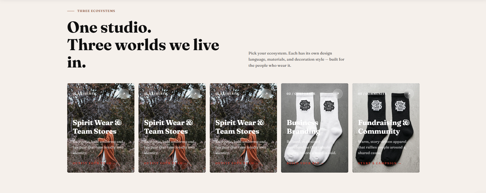

👉 **Source Code:** [`three-ecosystems-fully-customizable.liquid`](./three-ecosystems-fully-customizable.liquid)

*   **Key Features**:
    *   **Centered Flexbox Layout**: Automatically centers cards even if the grid isn't full.
    *   **Dynamic Desktop Grid**: Supports up to 6 columns with customizable gaps.
    *   **Mobile Layout Options**: Choose between Stacked, Grid, or Horizontal Scroll.
    *   **Premium Animations**: Smooth hover lifts, image scaling, and scroll reveal effects.

---

### 2. Parallax Arched & Stacked Collage
*A visually stunning collage section with deep parallax effects and arched frames.*

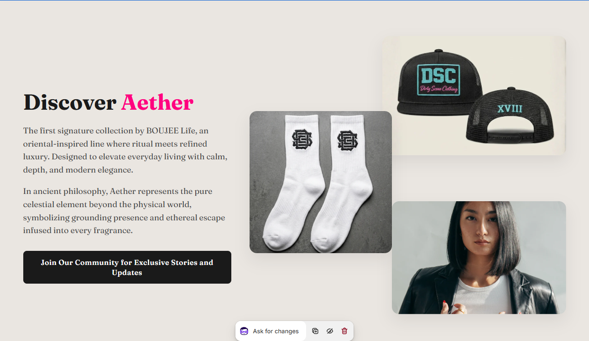

👉 **Source Code:** [`parallax-image-stacked-arched-section.liquid`](./parallax-image-stacked-arched-section.liquid)

*   **Key Features**:
    *   **Arched Image Masks**: Unique modern aesthetic for hero sections.
    *   **Deep Parallax**: Layered movement for a premium feel.
    *   **Collage Mode**: Intelligent overlapping algorithm for pixel-perfect layouts.
    *   **Custom Typography**: Integrated support for premium font families.

---

### 3. Editorial Staggered Layout
*Perfect for lifestyle brands and editorial-style storytelling.*

👉 **Source Code:** [`text-with-2image.liquid`](./text-with-2image.liquid)

*   **Key Features**:
    *   **Asymmetric Design**: Dual offset images with floating text blocks.
    *   **Badge Support**: Add custom icon badges and labels to images.
    *   **Responsive Flow**: Automatically adjusts staggered layout for mobile clarity.

---

### 4. Bento Marketing Grid
*Modern, modular grid layout inspired by Bento design principles.*

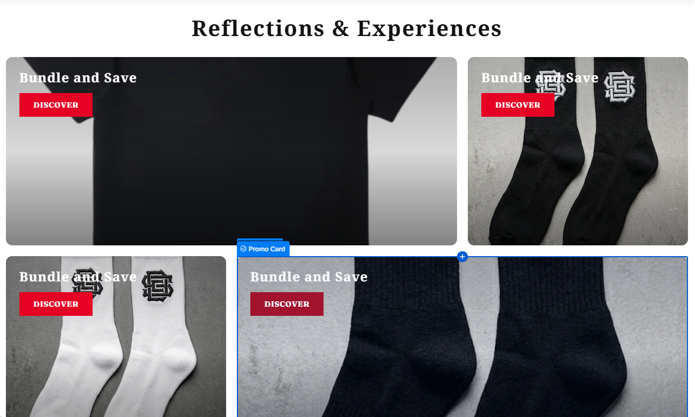

👉 **Source Code:** [`bento-4-grid-section.liquid`](./bento-4-grid-section.liquid)

*   **Key Features**:
    *   **Multi-Purpose Blocks**: Mix images, text, and CTAs in a cohesive grid.
    *   **Hover Zoom Effects**: Interactive scaling for increased engagement.
    *   **Dynamic Sizing**: Cards automatically span different areas for visual interest.

---

### 5. Bento Masonry Gallery
*A clean, header-integrated masonry gallery for showcasing products or brand assets.*

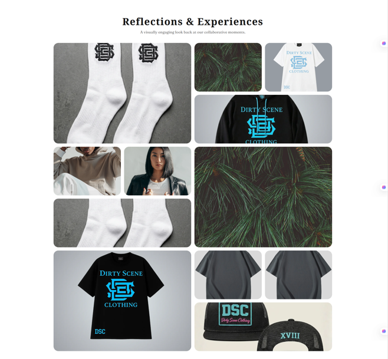

👉 **Source Code:** [`bento-grid-masonary.liquid`](./bento-grid-masonary.liquid)

*   **Key Features**:
    *   **Integrated Header**: Seamless transition from title to gallery.
    *   **Masonry Flow**: Smart packing of images with various aspect ratios.
    *   **Lightweight**: Zero external dependencies, pure CSS masonry.

---

### 6. Premium Testimonials & Reviews
*Build trust with a highly customizable and interactive customer review section.*

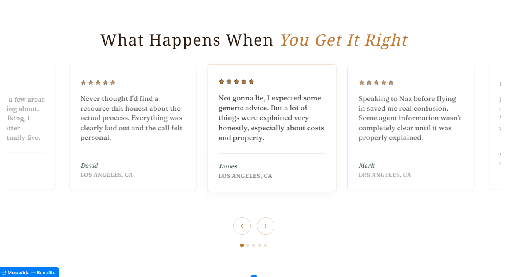

👉 **Source Code:** [`customer-review.liquid`](./customer-review.liquid)

*   **Key Features**:
    *   **Star Ratings**: Integrated dynamic star rating system.
    *   **Profile Images**: Support for customer avatars and social handles.
    *   **Carousel Support**: Optional horizontal flow for multiple reviews.

---

### 7. Custom Shop By Category (Circle)
*Intuitive navigation section using modern circular image frames.*

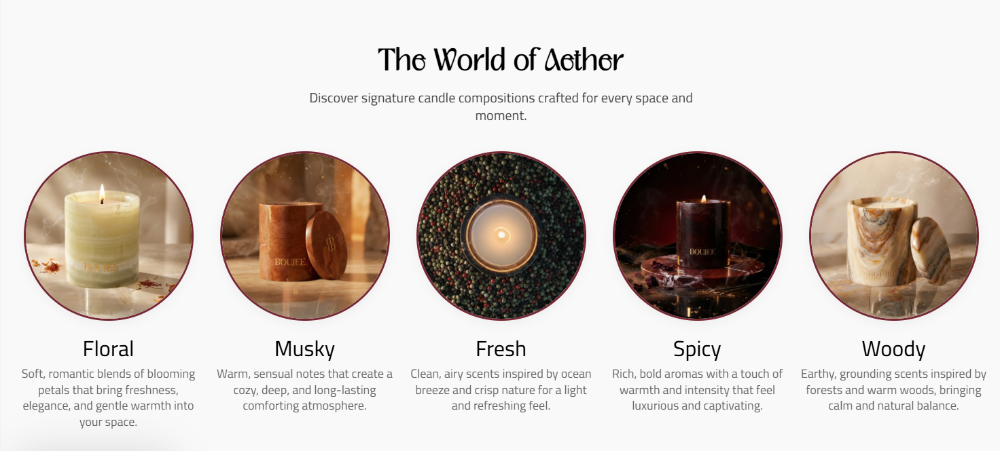

👉 **Source Code:** [`custome-collection-circle.liquid`](./custome-collection-circle.liquid)

*   **Key Features**:
    *   **Circular Masks**: Elegant rounded aesthetic for category navigation.
    *   **Shop By Occasion**: Designed specifically for gifting or collection browsing.
    *   **Responsive Grid**: Scales from 2 to 8 items across different screen sizes.

---

### 8. Custom FAQ Accordion
*A clean, interactive FAQ section to answer customer queries and improve SEO.*

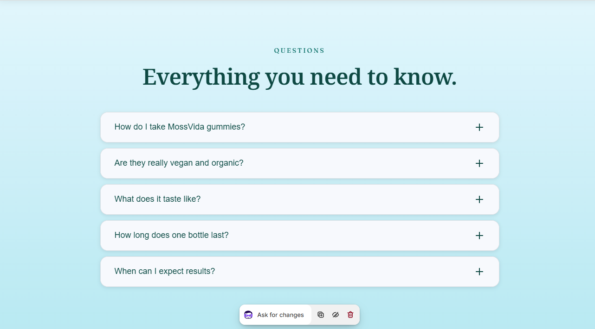

👉 **Source Code:** [`custom-faq.liquid`](./custom-faq.liquid)

*   **Key Features**:
    *   **Smooth Transitions**: High-performance CSS-based accordion animations.
    *   **SEO Optimized**: Structured for search engine visibility.
    *   **Fully Customizable**: Adjust icons, borders, and colors in the theme editor.

---

### 9. Premium Custom Features
*A feature-rich showcase section with floating testimonials and modern icons.*

👉 **Source Code:** [`custom-premium-features.liquid`](./custom-premium-features.liquid)

*   **Key Features**:
    *   **Floating Testimonial**: Interactive quote card that overlaps the main image.
    *   **Gradient Typography**: Beautifully styled gradient titles for high-end branding.
    *   **Feature Stack**: Clean list of benefits with customizable icons and backgrounds.
    *   **Modern Aesthetics**: Large border radii and soft shadows for a contemporary look.

---

### 10. Interactive Progress Pointer
*A scroll-animated process section to guide customers through your brand journey.*

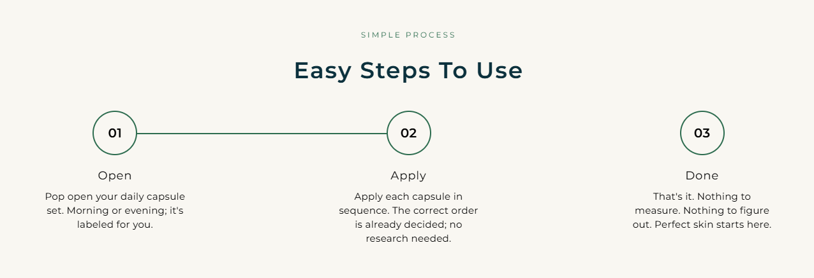

👉 **Source Code:** [`progress-pointer-section.liquid`](./progress-pointer-section.liquid)

*   **Key Features**:
    *   **Scroll Animation**: Progress line that fills as the user scrolls through the section.
    *   **Numbered Milestones**: Circular step indicators with customizable styles.
    *   **Process Visualization**: Ideal for "How it Works" or "Our Story" narratives.
    *   **Responsive Flow**: Switches to a clean vertical stack on mobile devices.

---

### 11. Custom Premium Hero
*A versatile, high-impact hero section designed for maximum conversion.*

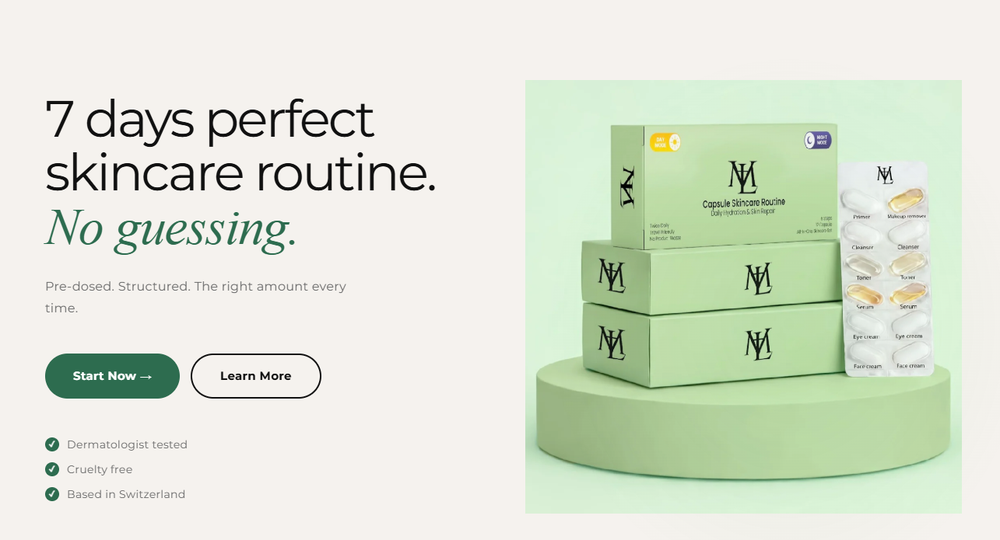

👉 **Source Code:** [`custom-hero.liquid`](./custom-hero.liquid)

*   **Key Features**:
    *   **Dynamic Overlays**: Control background opacity and text contrast easily.
    *   **Dual CTA Support**: Two primary call-to-action buttons with distinct styles.
    *   **Full-Height Option**: Toggle between viewport height or content-based height.
    *   **Parallax Background**: Optional smooth parallax effect for background images.

---

### 12. Comparison & Pricing Table
*A professional grid to showcase product differences or subscription plans.*

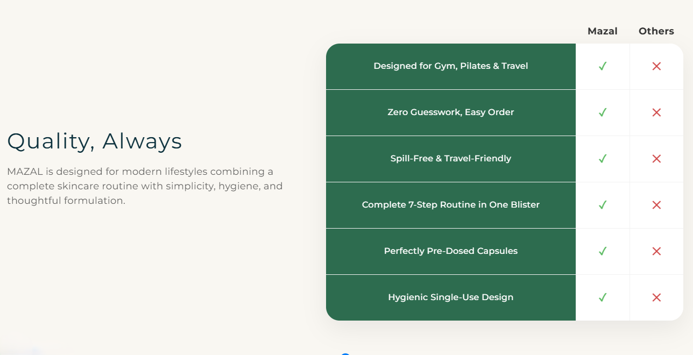

👉 **Source Code:** [`custom-comparison-section.liquid`](./custom-comparison-section.liquid)

*   **Key Features**:
    *   **Highlighted Column**: Feature a specific plan or product as "Recommended".
    *   **Status Icons**: Integrated checkmarks and crossmarks for feature lists.
    *   **Sticky Headers**: Keep plan names visible while scrolling (on supported devices).
    *   **Comparison Logic**: Clean, easy-to-read layout for decision-making.

---

### 13. Dynamic Brand Trustbar
*Build instant credibility with a scrolling bar of logos or trust badges.*

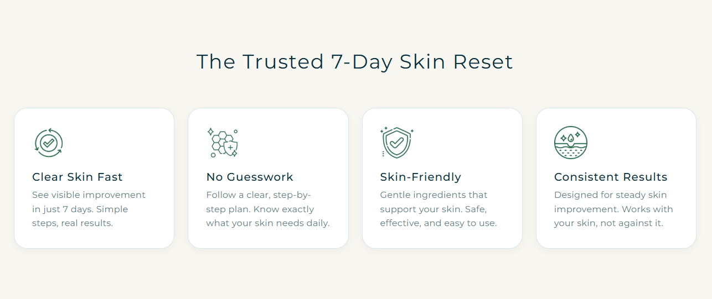

👉 **Source Code:** [`custom-trustbar.liquid`](./custom-trustbar.liquid)

*   **Key Features**:
    *   **Auto-Scroll Animation**: Seamless looping animation for brand logos.
    *   **SVG Integration**: Supports direct SVG code or image files for logos.
    *   **Flexible Layout**: Adjust logo size, spacing, and scrolling speed.
    *   **Merchant Controls**: Pause on hover and mobile-specific display options.

---

### 14. MossVida Premium FAQ
*A clean, card-based FAQ section with smooth grid-row animations.*

👉 **Source Code:** [`custome-fqa.liquid`](./custome-fqa.liquid)

*   **Key Features**:
    *   **Grid-Row Transitions**: Ultra-smooth opening/closing animations using modern CSS grid techniques.
    *   **Card-Based Layout**: Each question is housed in a distinct, styled card for clarity.
    *   **Icon Customization**: Choose between plus, chevron, or arrow icons with rotation effects.
    *   **Fully Responsive**: Optimized for mobile with adjustable padding and font sizes.

---

### 15. Animated Image Gallery
*A smooth, interactive slider gallery for showcasing products or brand imagery.*

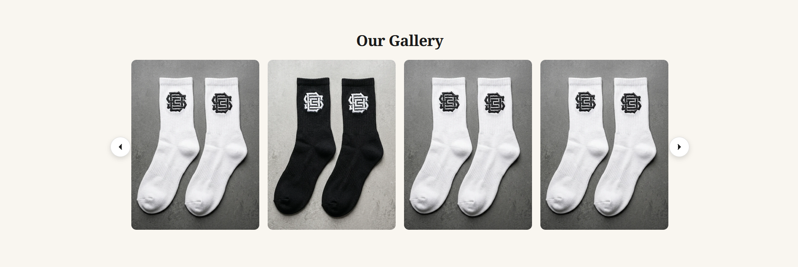

👉 **Source Code:** [`animated-image-gallery.liquid`](./animated-image-gallery.liquid)

*   **Key Features**:
    *   **Interactive Slider**: Smooth navigation through images with arrow controls.
    *   **Customizable Layouts**: Support for both grid and slider modes.
    *   **Versatile Shapes**: Toggle between rectangular or circular card styles.
    *   **Responsive Design**: Automatically adjusts column counts for mobile, tablet, and desktop.

---

### 16. MossVida "How It Works"
*A numbered process grid designed for brand storytelling.*

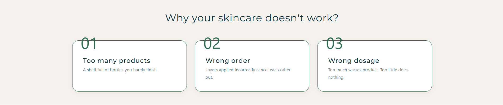

👉 **Source Code:** [`how-it-works-section.liquid`](./how-it-works-section.liquid)

*   **Key Features**:
    *   **Overlay Numbering**: Large, semi-transparent background numbers for a modern editorial feel.
    *   **Staggered Card Design**: Beautifully balanced grid of process steps with subtle gradients.
    *   **Typography Focused**: Fine-tuned control over kicker, heading, and description styles.
    *   **Lightweight**: Zero dependencies, optimized for fast loading and mobile responsiveness.

---

### 17. Before/After Image with Text
*An interactive image comparison slider paired with compelling copy and feature cards for product transformations.*

👉 **Source Code:** [`before-after-image-with-text.liquid`](./before-after-image-with-text.liquid)

*   **Key Features**:
    *   **Interactive Comparison Slider**: Drag-to-compare before and after images with smooth mouse and touch support.
    *   **Scroll Reveal Animations**: Fade-in and slide-up effects for text elements as the section comes into view.
    *   **Left Content Block**: Customizable label, heading with optional italic accent, subheading, and divider.
    *   **Feature Cards**: Up to 3 numbered feature cards with titles and descriptions, automatic slide animation on scroll.
    *   **Dynamic Slider Handle**: Gold accent circle with SVG arrow icons for clear interaction cues.
    *   **Custom Typography Control**: Fine-tuned font sizes for headings, subheadings, and card text.
    *   **Responsive Design**: Stacks vertically on mobile with maintained aspect ratio for images.
    *   **Full Customization**: Control colors for background, text, accent, cards, and more via theme editor.

---

### 18. Cinematic Hero Banner
*A high-impact, full-screen hero section with parallax backgrounds and interactive stats.*

👉 **Source Code:** [`cenemetic-hero-banner.liquid`](./cenemetic-hero-banner.liquid)

*   **Key Features**:
    *   **Cinematic Parallax**: Smooth background zoom and parallax effects for a premium feel.
    *   **Dual CTA Support**: Primary action button and secondary video/ghost button.
    *   **Trust Widget**: Integrated reviewer avatars and star ratings for social proof.
    *   **Bento Stats Grid**: Modern modular stats grid that optimizes for mobile layouts.
    *   **Overlay Control**: Precise adjustment of color, opacity, and blur for background images.

---

### 19. Interactive Path Timeline
*A visually guided process timeline with dashed connectors and icon badges.*

👉 **Source Code:** [`path-timeline.liquid`](./path-timeline.liquid)

*   **Key Features**:
    *   **Animated Path**: Dashed connector line that guides the user's eye through steps.
    *   **Icon Badges**: Circular badges for each step with support for custom image icons.
    *   **Numbered Milestones**: Elegant gold-accented numbering for clear sequence.
    *   **Scroll-Triggered Reveals**: Smooth fade-up animations as the user scrolls through the process.

---

### 20. Product Pro Bundle Cards
*Modern pricing cards with a unique flex-row layout and ribbon overlays.*

👉 **Source Code:** [`prdocut-block-pro-bundle.liquid`](./prdocut-block-pro-bundle.liquid)

*   **Key Features**:
    *   **Asymmetric Design**: Unique flex-row layout with image on the left and content on the right.
    *   **Ribbon Overlays**: Customizable "Best Value" or "Popular" ribbons for specific cards.
    *   **Feature Checklists**: Integrated list system with custom checkmark icons and dividers.
    *   **Premium Themes**: Easily toggle between light and dark themes per card for visual hierarchy.

---

### 21. Premium CTA Section
*A high-conversion split-layout CTA with glowing buttons and magnetic hover effects.*

👉 **Source Code:** [`cta-premiun-section.liquid`](./cta-premiun-section.liquid)

*   **Key Features**:
    *   **Split Layout**: Compelling content on the left with a visually anchored button on the right.
    *   **Magnetic Buttons**: Modern interaction effects with pulsing glow animations.
    *   **Blur Reveal**: Sophisticated staggered blur and fade animations on load.
    *   **Section BG Control**: Full control over background image scale, overlay, and gradients.

---

### 22. Image with Trust Card & Text
*An editorial layout featuring a handwriting-style trust card and video-ready image blocks.*

👉 **Source Code:** [`image-text-trust-section.liquid`](./image-text-trust-section.liquid)

*   **Key Features**:
    *   **Trust Badge Overlay**: Floating handwriting-style card for personal brand trust.
    *   **Editorial Layout**: Sophisticated grid spacing with large typography and handwriting accents.
    *   **Video Integration**: Support for video background or image fallback in the main block.
    *   **Responsive Flow**: Automatically adjusts the grid and card overlap for mobile devices.

---

### 23. Two-Column Grid FAQ
*A space-efficient accordion section with background image support and auto-close logic.*

👉 **Source Code:** [`two-colum-grid-faq.liquid`](./two-colum-grid-faq.liquid)

*   **Key Features**:
    *   **Dual Columns**: Maximizes space by showing FAQs in two columns on desktop.
    *   **BG Image Overlays**: Beautiful full-section background images with customizable overlays.
    *   **Smart Accordion**: Auto-closing logic for siblings to keep the layout clean.
    *   **Merchant Customization**: Extensive controls for colors, sizes, and layout gaps.

---

### 24. Flat Grid Slider Reviews
*A minimalist review section with grid-to-slider transformation for mobile.*

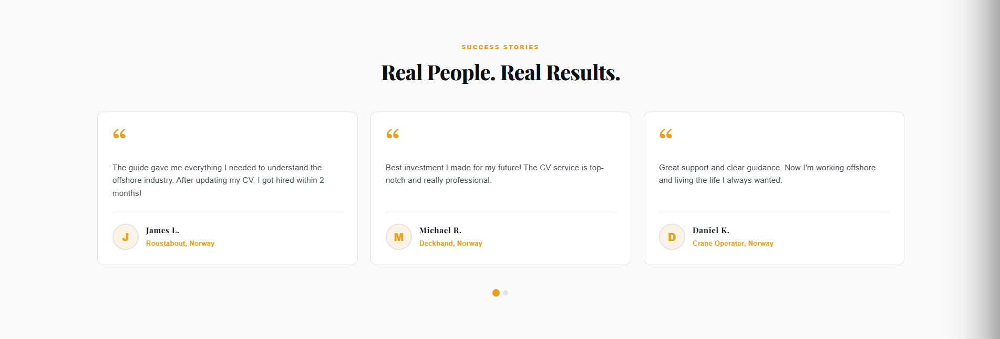

👉 **Source Code:** [`custom-review-section-flat-3.liquid`](./custom-review-section-flat-3.liquid)

*   **Key Features**:
    *   **Grid Slider**: Displays as a clean grid on desktop and transforms into a draggable slider on mobile.
    *   **Minimalist Design**: Flat card aesthetic with subtle borders and star ratings.
    *   **Customizable Columns**: Choose between 2 or 3 columns for the review grid.
    *   **Smooth Navigation**: High-performance touch and mouse dragging for the slider mode.

---

### 25. Premium Sidebar Header & Cart
*A sophisticated navigation system with integrated sidebar cart and mobile-optimized drawer.*

👉 **Source Code:** [`full-custom-header-with-sidebar-cart.liquid`](./full-custom-header-with-sidebar-cart.liquid)

*   **Key Features**:
    *   **Sidebar Cart Drawer**: Seamless slide-out cart for a modern shopping experience.
    *   **Solid Navigation**: Clean, sticky header with logo centering and custom CTA buttons.
    *   **Mobile Drawer**: Fully responsive mobile menu with spring-based animations.
    *   **Visual Polish**: Integrated cart count badges, overlays, and refined typography controls.

---

## 🛠️ Step-by-Step Installation Guide

Implementing any of these custom sections on your Shopify store is quick and completely code-free:

1.  **📁 Create the Section File**:
    *   Go to **Shopify Admin** -> **Online Store** -> **Themes**.
    *   Click the **three dots (...)** next to your active theme, then select **Edit Code**.
    *   Under the **Sections** folder, click **Add a new section**.
    *   Name your section (e.g. `three-ecosystems-fully-customizable`) and click **Create**.

2.  **📥 Paste and Save the Code**:
    *   Open the corresponding `.liquid` file from this repository.
    *   Copy the entire code content.
    *   Paste it into your newly created Shopify section file, replacing all default code.
    *   Click **Save** in the top-right corner.

3.  **🎨 Customize in Theme Editor**:
    *   Return to your Shopify Admin and click **Customize** on your theme.
    *   Click **Add Section** in the sidebar.
    *   Search for the section name and add it to your page!

---

## 🔒 Standalone Philosophy
*   **Zero Theme Pollution**: All CSS, Liquid, and Javascript are packaged inside a single `.liquid` file.
*   **Lightweight & Fast**: Code is fully optimized for speed, passing Shopify theme validation checks seamlessly.
*   **Responsive Natively**: Out-of-the-box support for all phone, tablet, and desktop screen widths.
